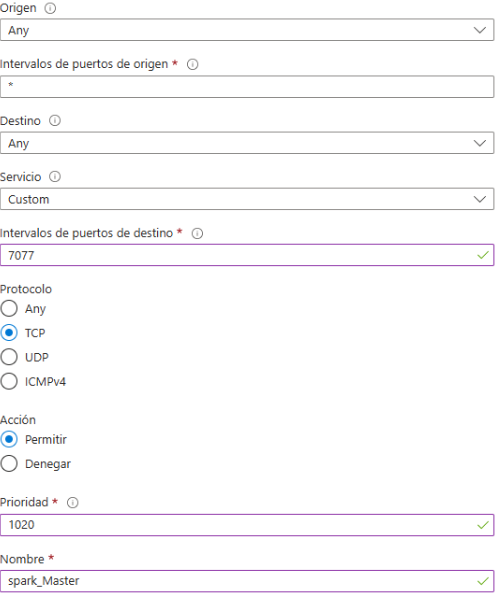

# Spark-Standalone_MV-Azure

En Spark en modo Standalone, se necesita una arquitectura distribuida con un nodo Máster y varios nodos Worker. Aunque es posible configurar todo en una sola máquina, el verdadero potencial de Spark se aprovecha con múltiples nodos. 
1. Nodo Máster: Es el encargado de gestionar el clúster y coordinar las tareas entre los Workers, pero no       procesa los datos directamente. Además, ofrece una interfaz web para monitorear el estado de los             trabajos y recursos del clúster. 

2. Nodos Workers: Son los que ejecutan las tareas asignadas por el Máster. Cuantos más Workers haya, mejor      se distribuye la carga y mayor es la capacidad de procesamiento, lo que permite manejar grandes volúmenes    de datos más rápidamente. 

3. Importancia de ambos (Máster y Workers): Sin Workers adicionales, todo el procesamiento recaería en el       Máster, reduciendo el rendimiento. Con varios Workers, el procesamiento se distribuye de manera paralela,    mejorando la escalabilidad, disponibilidad y confiabilidad del clúster. 

4. Funcionamiento de Spark Standalone: El nodo Máster coordina la distribución de tareas y recursos,            mientras que los Workers ejecutan las tareas. 

¿Un solo nodo?: Es posible ejecutar Spark en un solo nodo (Máster y Worker en la misma máquina), lo que es útil para pruebas o aprendizaje, pero no es adecuado para grandes volúmenes de datos o producción, ya que no se aprovecha el procesamiento distribuido.

# Spark STandalone con un solo nodo.
## 1. Crear una máquina virtual en Azure.
Ir a Azure portal, en “crear un recurso” y se selecciona Máquina virtual para crearla.


### basic:


cuenta de admnistrador tener en cuenta el nombre de usuario.


### discos:


 redes, administración, supervisión, opciones avanzadas y etiquetas: no se modifica nada

se hace click "REVISAR Y CREAR" y dar click a descargar 


### Agregar puertos.





Luego de agregar los puertos se va a conectar para copiar el IP Publica.


## 2. Conectar a la máquina virtual vía SSH 
Abrimos CMD  y escribimos el siguiente comando.
```
ssh -i <ruta/clave.pem> <user>@<IP Publica>
```

## 3. Instalación de Java.
```
sudo apt udate
```
instalacioón de java:
```
sudo apt install -y openjdk-11-jdk
```
comprabar si está instalado:
```
java -version
```
## 4. Instalación Python para PySpark:
```
sudo apt update
```
Instalación de python y pip:
```
sudo apt install -y python3 python3-pip
```
comrpbar si esta instalado:

* python:
```
python3 –-version 
```
* pip:
```
pip3 --version
```
## 5. Instalación Scala:
```
wget https://downloads.lightbend.com/scala/2.13.6/scala-2.13.6.deb
```
```
sudo dpkg -i scala-2.13.6.deb
```
comprobar que se ha instalado:
```
scala -version
```

## Instalción MySQL(opcional):
```
sudo apt update
```
instalacion de MySQL:
```
sudo apt install -y mysql-server
```
Iniciar MySQL:
```
sudo systemctl start mysql
```
Configuración en MySQL:
```
sudo mysql_secure_installation
```
dentro de la configuracion sale las siguientes preguntas:
1. Componente de validacion de contraseña la opcion es 0=low, 1=medium 2=strong, esot es para saber que la contraseña va tener mayusculas, minusculas, numeros y caracteres mas de 8 caracteres. Aqui es preferencia.
2. sin contraseña para el usuario: yes/no
3. Elinimar usuarios anónimos: yes/no
4. Deshabilitar el acesso remoto del usuario: yes/no
5. eliminar la base de datos de prueba: yes/no
6. recargar las tablas de privilegios: yes/no

Para conectar SparkSQL a MySQL:
```
wget https://dev.mysql.com/get/Downloads/Connector-J/mysql-connector-j_8.0.32-1ubuntu22.04_all.deb
```
```
sudo dpkg -i mysql-connector-j_8.0.32-1ubuntu22.04_all.deb
```
La creacion de un usuario y base de datos con una tabla como prueba para luego hacer la conexion:
entrar a MySQL:
```
sudo mysql
```
crear y contraseña (la contraseña depende de la eleccion que se ha hecho low, medium, strong)
```
CREATE USER '<usuario_externo>'@'%' IDENTIFIED BY '<password>'; 
```
@'%' permite que el usuario se conecte desde cualquier dirección IP. Si solo quieres permitir acceso desde una IP específica (por ejemplo, solo desde localhost o desde otra VM), puedes especificar la IP en lugar de %. 

Dar permisos:
```
GRANT ALL PRIVILEGES ON dbPrueba.* TO '<usuario_externo>'@'%';
```
recargar los privilegios para que se produzca los cambios
```
FLUSH PRIVILEGES;
```
Configuracion MySQL PARA ACPETAR CONEXIONES EXTERNAS
Abre el archivo de configuración de MySQL que generalmente se encuentra en /etc/mysql/mysql.conf.d/mysqld.cnf.
```
sudo nano /etc/mysql/mysql.conf.d/mysqld.cnf
```
buscas la linea bind-address = 127.0.0.1 y se cambia a 0.0.0.0 y luego el siguiente comando:
```
sudo systemctl start mysql
```
Creación la base de datos.
entrar a MySQL
```
mysql -u usuario_externo –p
```
Crear la base de datos prueba;
```
CREATE DATABASE <dbPrueba>;
```
Acceder a la base de datos creada:
```
USE <dbPrueba>; 
```
crear la tabla (los datos son ejemplo):
```
CREATE TABLE empleados ( id INT AUTO_INCREMENT PRIMARY KEY, nombre VARCHAR(100), edad INT, puesto VARCHAR(100) ); 
```

Insertar datos en la tabla "emplados":
```
INSERT INTO empleados (nombre, edad, puesto) VALUES ('Juan Perez', 30, 'desarrollador'), ('Laura Gomez', 25, 'Analista'), ('Carlos', 40, 'Gerente');
```

salir de MySQL:
```
exit
```

## 7. Instalación Apache Spark.
instalación de Spark:
```
wget https://downloads.apache.org/spark/spark-3.5.3/spark-3.5.3-bin-hadoop3.tgz 
```
Extraer Spark:
```
tar xvf spark-3.5.3-bin-hadoop3.tgz
```
mover spark a opt:
```
sudo mv spark-3.4.0-bin-hadoop3 /opt/spark
```
## 8. Confiración de las variables de entorno.
dentro de la carpeta spark
```
nano ~/.bashrc
```
Excribimos eb el fichero las siguientes lineas:
```
export SPARK_HOME=/opt/spark 

export PATH=$PATH:/opt/spark/bin 

export JAVA_HOME=/usr/lib/jvm/java-11-openjdk-amd64 

export PYSPARK_PYTHON=python3
```
Aplicamos los cambios:
```
source ~/.bashrc
```
## 9. Configuración de Spark.
* configuración spark-env.sh:
  ```
  cd conf
  ```
  ```
  cp spark-env.sh.template spark-env.sh
  ```
  en el ficheor se añade la siguiente linea:
  ```
  export SPARK_MASTER_HOST=localhost
  ```
* congifuracion la memoria de Spark:
  en la misma carpeta conf se edita el archivo spark-defaults.conf
  ```
  cp spark-defaults.conf.template spark-defaults.conf
  ```
  ```
  nano spark-defaults.conf
  ```
  se añade las siguientes lineas:
  ```
  spark.executor.memory 2g 
  spark.driver.memory 2g 
  ```

  ## 10. Iniciar Spark en modo Standalone

  iniciar el nodo Master:
  ```
  /opt/spark/sbin/start-master.sh
  ```
  para comporbar en el navegador la ippublica de la maquina virtual de Azure : puero 8080

  
  
  iniciar el nodo Worker:
  ```
  /opt/spark/sbin/start-master.sh
  ```
  ```
  /opt/spark/sbin/start-worker.sh spark://localhost:7077
  ```
  para comporbar en el navegador la ippublica de la maquina virtual de Azure : puero 8080
  
  
  
## 11. Ejecutar un trabajo en Spark.
### 1. PySapark
  ```
  pyspark
  ```

Pruebas Simples:
* verificar la version de Spark:
  ```
  sc.version
  ```
* Crear un RDD
  ```
  numbers = sc.parallelize(range(1, 11)) 
  print(numbers.collect()) 
  ```
* Realizar una trnasformación sobre un RDD
  ```
  squares = numbers.map(lambda x: x * x) 
  print(squares.collect())
  ```
* Crear un DataFrame desde una lista de tuplas
  ```
  data = [("Alice", 34), ("Bob", 45), ("Cathy", 29)] 
  df = spark.createDataFrame(data, ["name", "age"]) 
  df.show()
  ```
* Filtrar datos de una DataFrame
  ```
  df.filter(df.age > 30).show()
  ```
* Realizar una accion en el DataFrame
  ```
   df.count()
  ```
* Salir de pyspark
  ```
  exit()
  ```
### 2. Scala
```
spark-shell
```
Pruebas
* verificar la version:
  ```
  sc.version
  ```
* crear un RDD
  ```
  val numbers = sc.parallelize(1 to 10) 
  numbers.collect() 
  ```
* Realizar una operacion de transformacion en un RDD
  
  ```
  val squares = numbers.map(x => x * x) 
  squares.collect()
  ```
* Crear un DataFrame a paritr de una lista de tuplas
  ```
  import spark.implicits._
  val df = Seq(("Alice", 34), ("Bob", 45), ("Cathy", 29)).toDF("name", "age")
  df.show() 
  ```
* salir
  ```
  :quit
  ```

## 12. Conectar la base de datos MySQL con Spark
Localizar el archivo JAR de MySQL Connector:
```
dpkg -L mysql-connector-j
```
la ruta tipica La ruta típica suele estar en /usr/share/java/. + mysql-connector-java-8.0.32.jar

Iniciar Spark con el conector JDBC de MySQL. Usa la ruta al .jar que obtuviste con dpkg -L: dpkg -L mysql-connector-j 

 ### PySpark
  ```
  pyspark --jars /usr/share/java/mysql-connector-j-8.0.32.jar
  ```
Una vez dentro de la terminal de spark podemos pegar el codigo directamente esto es escribiendo el codigo dentro de spark, esta es una manera sin script: 
```
# Importa las librerías necesarias de PySpark 

from pyspark.sql import SparkSession 

# Inicializar SparkSession y configurar el conector JDBC 

spark = SparkSession.builder \ 

    .appName("MySQLConnection") \ 

    .config("spark.jars", "/usr/share/java/mysql-connector-j-8.0.32.jar") \ 

    .getOrCreate()  # Corrección aquí, sin comentario en la línea de continuación 


# Configuración de la conexión JDBC 

jdbc_url = "jdbc:mysql://localhost:3306/dbPrueba" 

connection_properties = { 

    "user": "usuario_externo", 

    "password": "ContraseñaSegura!123", 

    "driver": "com.mysql.cj.jdbc.Driver" 

} 

# Leer los datos desde MySQL en un DataFrame de Spark 

df = spark.read.jdbc(url=jdbc_url, table="empleados", properties=connection_properties) 

# Mostrar los datos cargados 

df.show() 
```

La otra manera con un script
```
nano mysql_spark_conn.py
```
en el archivo copiamos en codigo anterior, se guarda y luego lo ejecutamos:
```
spark-submit --jars /usr/share/java/mysql-connector-j-8.0.32.jar mysql_spark_conn.py
```
para hacer consultas, usando el script añadimos las siguientes lineas.
```
# Registrar el DataFrame como una vista temporal 

df.createOrReplaceTempView("empleados_temp") 

# Consulta SQL para filtrar empleados mayores de 30 años 

result_sql = spark.sql("SELECT * FROM empleados_temp WHERE edad > 30") 

result_sql.show() 

# Consulta SQL para seleccionar nombre y puesto de los empleados 

result_sql2 = spark.sql("SELECT nombre, puesto FROM empleados_temp") 

result_sql2.show() 

# Consulta SQL para contar empleados por puesto 

result_sql3 = spark.sql("SELECT puesto, COUNT(*) AS cantidad_empleados FROM empleados_te> 

result_sql3.show() 

# Filtrar empleados mayores de 30 años 

result_df = df.filter(df["edad"] > 30) 

result_df.show() 

# Seleccionar nombre y puesto 

result_df2 = df.select("nombre", "puesto") 

result_df2.show() 

# Agrupar empleados por puesto y contar cuántos hay 

result_df3 = df.groupBy("puesto").count() 

result_df3.show() 

# Detener la sesión de Spark 

spark.stop() 
````
luego se vuelve a ejecutar:
```
spark-submit --jars /usr/share/java/mysql-connector-j-8.0.32.jar mysql_spark_conn.py
```
### Scala
```
spark-shell --jars /usr/share/java/mysql-connector-j-8.0.32.jar
```
dentro del terminal de spark-shell ejecutamos el siguiente codigo sin script
```
// Cargar el conector JDBC de MySQL 

val jdbcUrl = "jdbc:mysql://localhost:3306/dbPrueba" // Cambia según tu base de datos 

val connectionProperties = new java.util.Properties() 

connectionProperties.put("user", "usuario_externo")  // Tu usuario MySQL 

connectionProperties.put("password", "ContraseñaSegura!123") // Tu contraseña MySQL 

connectionProperties.put("driver", "com.mysql.cj.jdbc.Driver") 

// Leer datos desde MySQL en un DataFrame 

val df = spark.read.jdbc(jdbcUrl, "empleados", connectionProperties) 

// Mostrar los datos cargados 

df.show()
```
con script con las lineas de la conexión y las consultas
```
// Cargar el conector JDBC de MySQL 

val jdbcUrl = "jdbc:mysql://localhost:3306/dbPrueba" // Cambia según tu base de datos 

val connectionProperties = new java.util.Properties() 

connectionProperties.put("user", "usuario_externo")  // Tu usuario MySQL 

connectionProperties.put("password", "ContraseñaSegura!123") // Tu contraseña MySQL 

connectionProperties.put("driver", "com.mysql.cj.jdbc.Driver") 

// Leer datos desde MySQL en un DataFrame 

val df = spark.read.jdbc(jdbcUrl, "empleados", connectionProperties) 

// Mostrar los datos cargados 

df.show()
// Paso 4: Leer los datos de la tabla "empleados" en un DataFrame
val df = spark.read.jdbc(jdbcUrl, "empleados", connectionProperties) 

 // Paso 5: Registrar el DataFrame como una vista temporal para usar
 SQL df.createOrReplaceTempView("empleados_temp")  

// Paso 6: Realizar consultas SQL sobre la vista temporal  

// 6.1. Consulta 1: Mostrar todos los empleados mayores de 30 años
val result1 = spark.sql("SELECT * FROM empleados_temp WHERE edad > 30") result1.show() 

 // 6.2. Consulta 2: Mostrar solo los nombres y puestos de los empleados
val result2 = spark.sql("SELECT nombre, puesto FROM empleados_temp") result2.show() 

 // 6.3. Consulta 3: Contar cuántos empleados hay por puesto
val result3 = spark.sql("SELECT puesto, COUNT(*) AS cantidad_empleados FROM empleados_temp GROUP BY puesto") result3.show()  

// Paso 7: Usar las funciones de DataFrame para realizar otras consultas
// 7.1. Filtrar empleados mayores de 30 años y seleccionar nombre y puesto

val result4 = df.filter(df("edad") > 30).select("nombre", "puesto") result4.show()  

// 7.2. Agrupar los empleados por puesto y contar cuántos hay por puesto
val result5 = df.groupBy("puesto").count() result5.show()  

// Paso 8: Detener la SparkSession cuando ya no la necesites spark.stop()
```
para ejecutar el script 
```
:load mysql_spark_conn.scala
```
